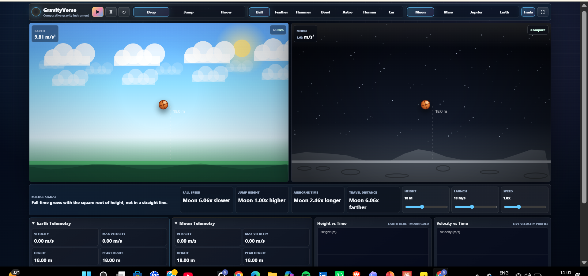

# GravityVerse 🚀

An interactive gravity simulator for comparing movement across celestial bodies.

🌍 Live Demo:
https://manglanandini8-design.github.io/gravityverse/

## Screenshot

## Features

- Compare gravity across planets and moons
- Visual jump simulations
- Height and airtime calculations
- Interactive educational experience

## Technologies Used

- HTML
- CSS
- JavaScript

## Purpose

GravityVerse helps users understand how gravity differs across celestial bodies by visualizing its effect on movement and jump behavior.
